The Artful Rachel website allows people to learn about the works of an artist named Rachel as well as view information about upcoming events and showings for the artist. The visitors of the website could quickly access social media links for the artist and request custom artwork.

The site can be accessed by this [link](https://rachelfromireland.github.io/the-artful-rachel/).

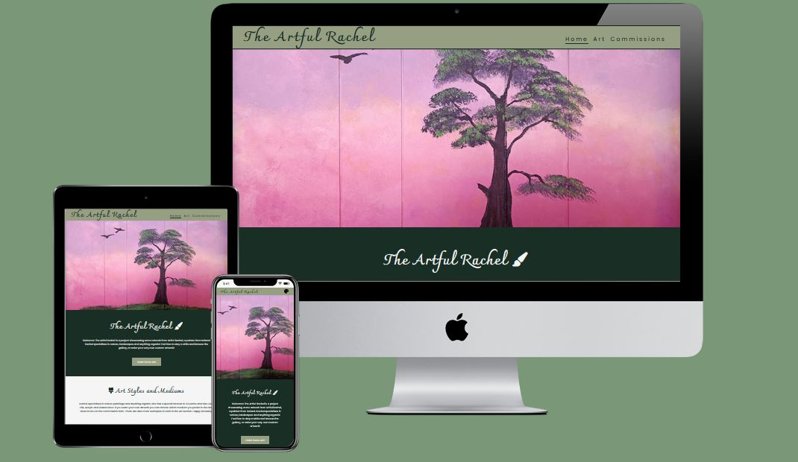

# User Stories
### First Time Visitor Goals:
- As a First Time Visitor, I want to understand the site’s main purpose at a glance, so I can learn more about the artist.
- As a First Time Visitor, I want the site to be easy to read and intuitive to navigate to avoid leaving because it is frustrating and instead have a pleasant user experience.
- As a First Time Visitor, I want to see examples of previous artwork, so I can gauge the quality for myself before considering ordering.

### Returning Visitor Goals:
- As a Returning Visitor, I want to see an easy-to-read and complete form to purchase custom artwork.
- As a Returning Visitor, I want to see information about artwork, so I can decide for myself which medium and surface I like best.
- As a Returning Visitor, I want to find a way to get in contact with the organization, so that I can ask any questions I have via email without filling in the commission form.
- As a Returning Visitor, I want to find links to the artist’s social media, so I can see even more up-to-date artwork.

### Frequent Visitor Goals:
- As a Frequent User, I want to be able to see updated live events and an updated gallery page showing the artist cares about the website and keeping things up to date.

# Features

## Navbar

- Positioned at the top of the page.
- Contains the name of the website on the left side.
- Contains navigation links on the right side:
  - Home: Leads to the home page.  Users can learn about the Artful Rachel, including live event info.
  - Art: Leads to the art gallery page where users can see completed works by the artist.
  - Commissions: Leads to the commission form page where users can fill out the form to begin the process of ordering custom artwork.

The links have an animated hover effect. 
The navigation is clear and easy to understand for the user.

The navigation bar is responsive:

On Mobile Devices the navigation bar is hidden and is toggled by a palette button on the right-hand side.

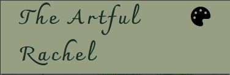

When the palette menu is clicked, there is a dropdown menu with the links in the same order. 

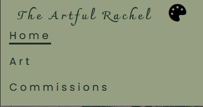

## Home Page
#### Represents:
- The main business of the artist.
- Describes the artist and their style.
- Shows live event dates and info.
- Invites users to fill out the commission form.
 
 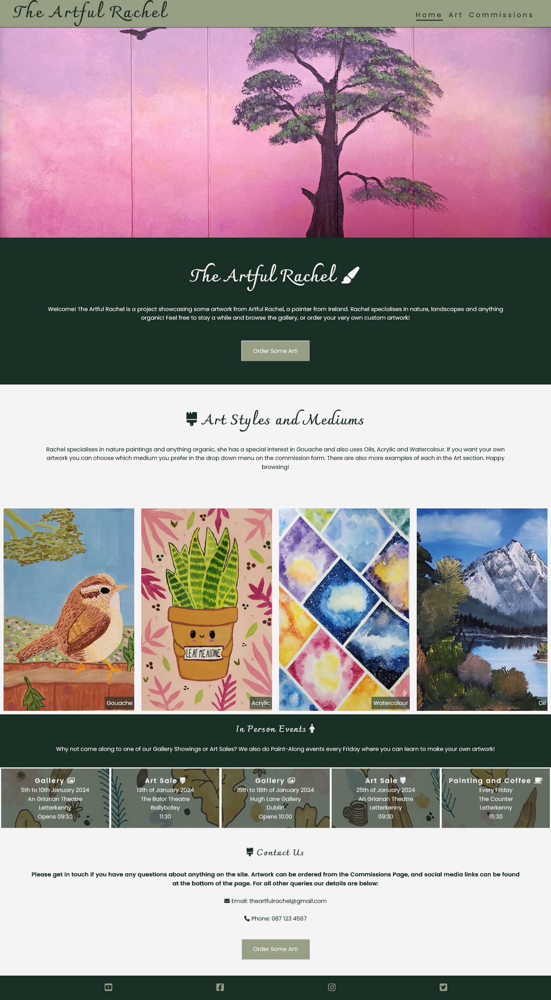

### Banner Section
The Banner section has a fixed background image.
Directly below the banner is an information section that contains:
- The name of the artist's website.
- Short description of the artist’s style.
- Contact button that leads directly to the commission page.

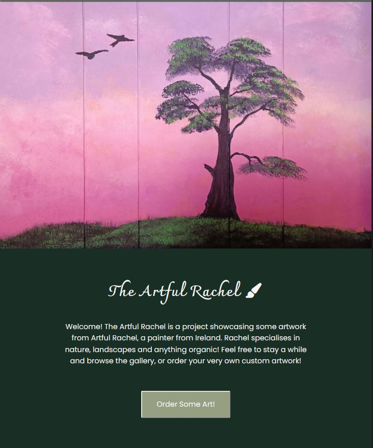

### Art Styles Section
- The Art Styles Section begins with a short description of the artist’s mediums and reminds users they can order custom art.
- The Art Styles Section has some images of recent artworks, which can also be seen in the gallery.  One image for each medium type the artist uses.
- Entices viewers to consider ordering a piece of custom artwork.

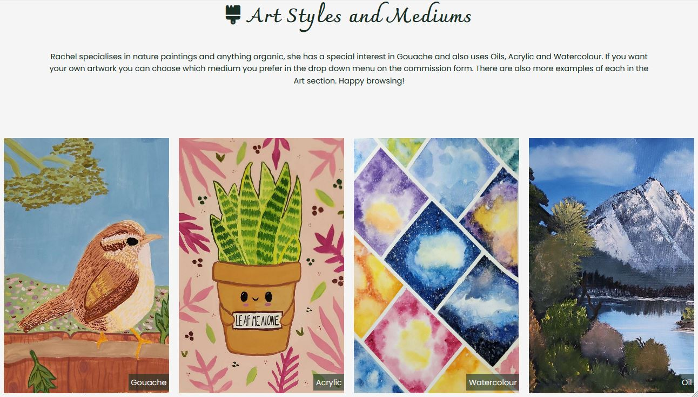

### Events Section
- The Events section has four upcoming events and one ongoing event, gallery showings, art sales and a paint-along session.
- Each box has an icon displayed with the text.
- Each box has the address and date of the event listed.
- Each box is transparent and situated on a background image.

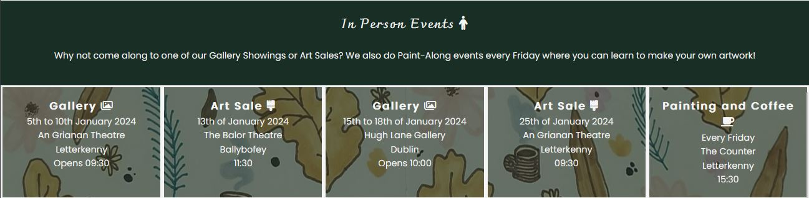

### Contact Us Section
- The Contact Us Section has an explicit message for the visitors of the website to contact the artist.
- It contains an email and phone number so users can query about things not related to ordering art or that aren’t covered by the form.
- It also has a button that directs to the commission page.  

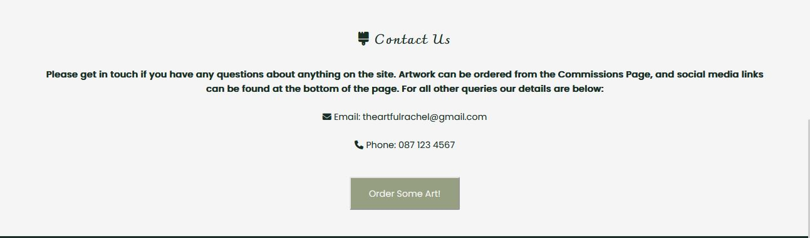

### Footer
The footer contains social media links that open in a new tab.  

## Art Gallery Page
- The Gallery page has an identical banner image and a message for the visitors that contains a short description and invites them to hover over an image to learn more.
- It has a button after the description that leads to the commission page.
- It has photos of past artworks completed by the artist and serves as a virtual gallery.
- The gallery is responsive, the amount of columns will depend on the user’s screen size.
- Each image has a description of the artwork that can be seen when the user hovers a mouse over the image; or taps when on a mobile or tablet.
- The description contains the name of the artwork, the medium used and the surface it was painted on.
- It has a footer which is identical to the home page's footer.

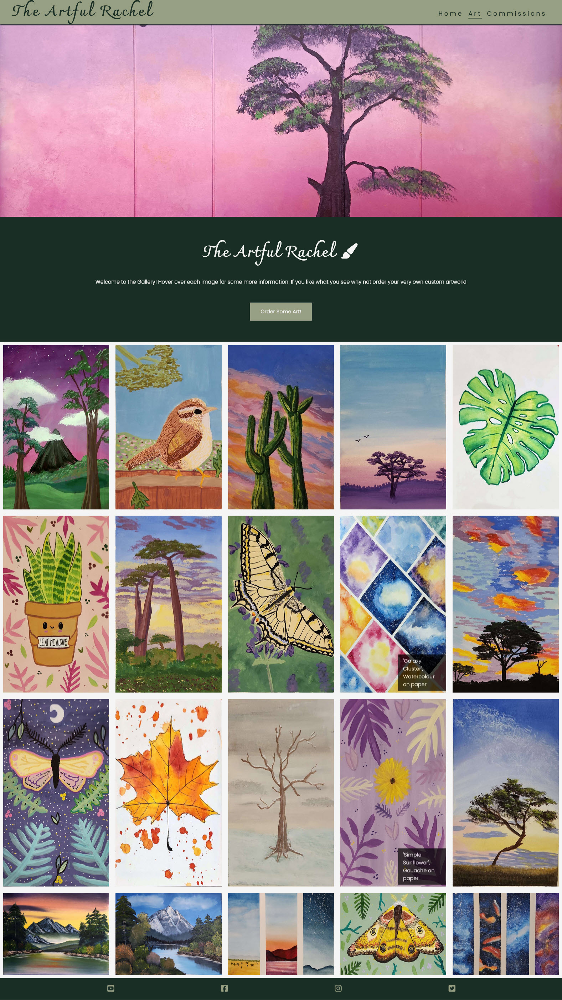

## Commission page
The Commission page contains a contact form:
- All text input fields are customized.
- All inputs are set to be required to be filled out.
- It has a custom dropdown matching the submit button with four options for the desired medium: Oil, Acrylic, Gouache and Watercolour.
- The text inputs, dropdown and submit button are animated on hover.
- The page is responsive on all common screen sizes.
- The submit button leads to the Thank You page. 

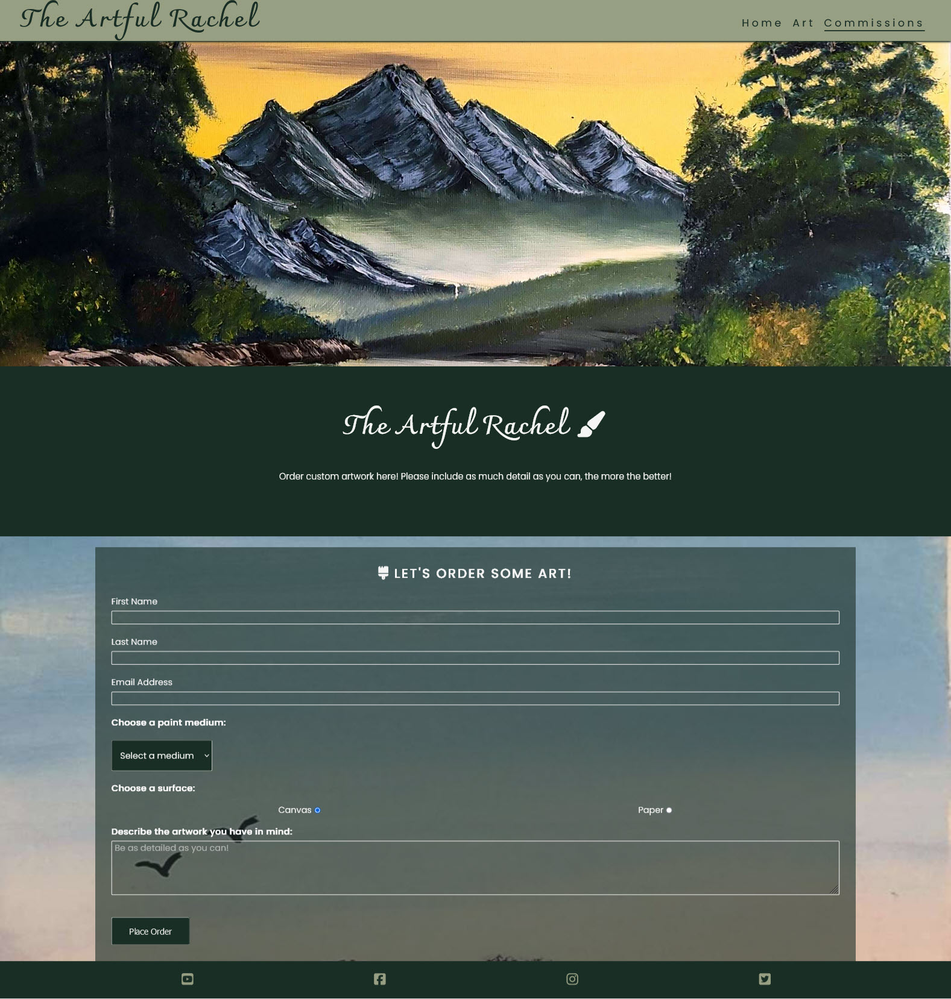

## Thank You Page
- The Thank You page appears after submitting the commission form.
- It contains a thank you message with some additional information about order times.
- There is a button below the message which brings the user back to the home page.

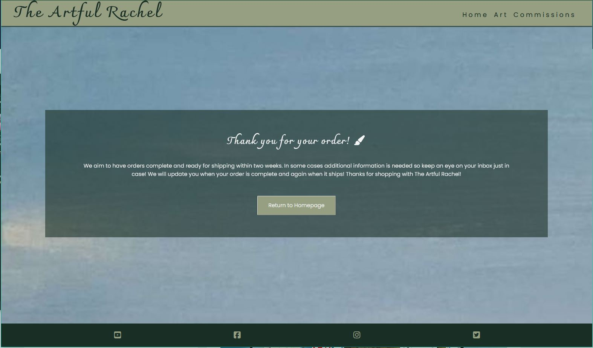

# Technologies Used
HTML was used as the foundation of the site.

CSS - was used to add the styles and layout of the site.

CSS Flexbox - was used to arrange elements on the pages.

CSS Grid - was used to make "gallery" and "commission" pages responsive.

VSCode was used as the main tool to write and edit code.

Git was used for the version control of the website.

GitHub was used to host the code of the website.

# Design
The original idea for this project was to create an online gallery and commissions request page for an artist or painter.  The first draft can be seen in the wireframes below.

Original concept for Homepage:

Original concept for Gallery:

Original concept for Commissions Form:

## Color Scheme
The project uses a limited color scheme, found [here](https://looka.com/blog/12-fall-color-palettes/).  The chosen palette was number 12 – Idle Afternoon, with the two colors specifically being `#979f83` and `#192e25`.  These were converted to RGBA for when transparency was needed.  These colors were chosen as they were warm and inviting, and will not clash with any of the artwork.

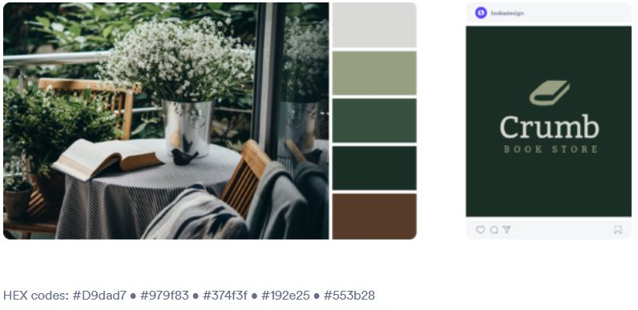

## Typography
### Main Font
Poppins from Google Fonts is the main font of the website to increase the readability of the content on the pages.

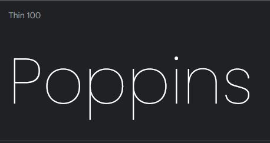

### Logo Font
Charmonman from Google Fonts was used to attract viewers' attention to the artist’s logo.  It was chosen as it looks handwritten and matches the theme of the site.

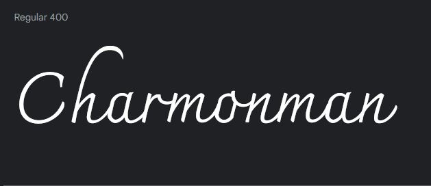

## Testing

- I tested this page in different browsers to ensure it worked.  The browsers tested were Chrome, Firefox and Safari.
- I have used DevTools to confirm that the project is responsive and looks good on all standard screen sizes.
- I have proofread all the text and checked that elements are easy to read and understand.
- I have tested the commission form and confirmed the animated elements work.  I have also checked to ensure the Thank You page is loaded after the user hits the submit button.
- User Goals were kept in mind while testing and the project meets all goals.

### Bugs
#### Solved Bugs
| Bug | Solution |
| ---| ---|
| The gallery and homepage images were showing errors in the validator due to their height and width values. | Solution: Moved the styling for these images to CSS |
| The images in the gallery were not showing in full and the images exceeded the screen width. | Updated CSS grid in the stylesheet to have columns fill the available space and added margins and padding where needed.  Resized all image files so they were the width of the container to prevent images from appearing cropped or overlapped. |
|  |  |

#### Unsolved Bugs
No unsolved bugs were detected after testing.

### Validator Testing
HTML
- No errors were found when passing through the official [W3C validator](https://jigsaw.w3.org/css-validator/).  A screenshot of the results for the [Homepage](/documents/html-validator-screenshot.png), [Gallery](/documents/gallery-validator-screenshot.png) and [Commissions](/documents/form-validator-screenshot.png) have been uploaded.

CSS
- No errors were found when passing through the official [(Jigsaw) validator](https://validator.w3.org/)

# Deployment
### Deployment to GitHub Pages
The site was deployed to GitHub pages. The steps to deploy are as follows:
- In the GitHub repository, navigate to the Settings tab
- From the source section drop-down menu, select the Main Branch, then click "Save".
- The page will be automatically refreshed with a detailed ribbon display to indicate the successful deployment.

The live link can be found [here](https://rachelfromireland.github.io/the-artful-rachel/).
### Deployment Locally
In order to make a local copy of this project, you can clone it. In your IDE Terminal, type the following command to clone my repository:

git clone https://github.com/RachelfromIreland/the-artful-rachel.git

# Future improvements
- In the future, I would like the images in this project to grow as the browser page grows.  I decided not to implement this at this time as the image quality is poor when they appear larger due to the resizing completed to fix a bug mentioned above.

- Commit messages.  I’m very new to coding and feel I can commit more frequently with more descriptive messages.

# Credits
## Content
- Inspiration for the footer as well as style elements cited within the code come from Code Institute’s Love Running project. 

- Elements of the CSS styling are directly inspired by my mentor Julia Konovalova’s [“Animal Shelter”](https://github.com/IuliiaKonovalova/animal_shelter/blob/main/gallery.html#L69C10-L73C25) project, these have also been cited in the code.

- The Gallery page’s hover animation which shows text was inspired by a YouTube video by [Kevin Powell](https://www.youtube.com/watch?v=ceNMP-aQkQ4).

- Making CSS grid responsive for the columns in the gallery and style sections was learned from an article by [Aidan K McBride](https://aidankmcbride.medium.com/css-tips-and-tricks-81d3c641428).
## Media
All the images for the website are the author’s own.
# Tools
- W3Schools was a huge help for me in understanding how to make the things I wanted to code more readable.
- Paint 3D was used to resize images.
- [Wireframe cc](https://wireframe.cc/) was used to create the wireframes.

